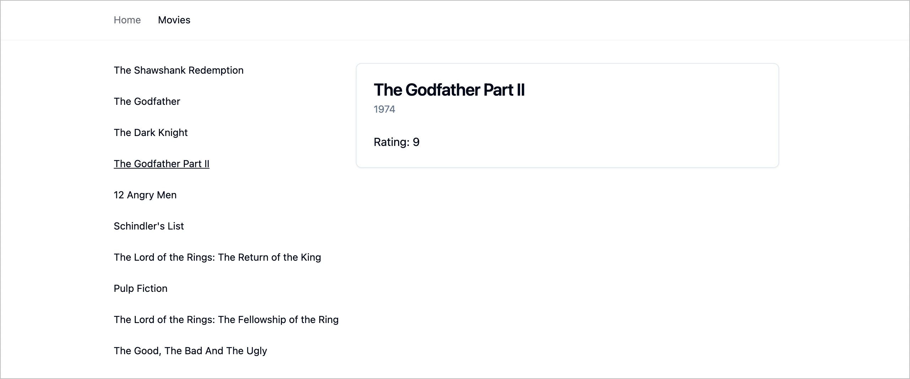

# React Router Nested Layouts



Live demo: https://nextjs-nested-layouts-ruby.vercel.app/

This repository shows how to nest layouts using React Router.

## Development Build

```shell
npm ci
npm run dev
```

Now point your browser to http://localhost:3000

## Production Build

```shell
npm ci
npm run build
npm run preview
```
